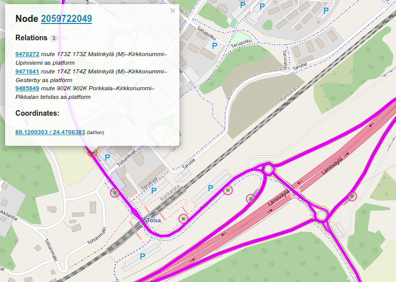
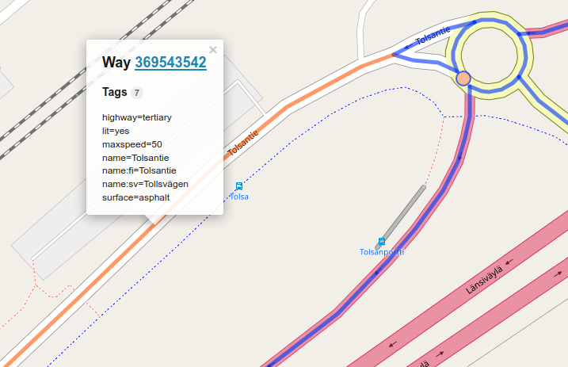
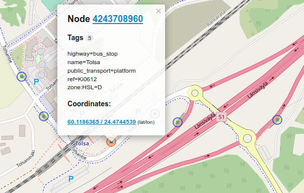
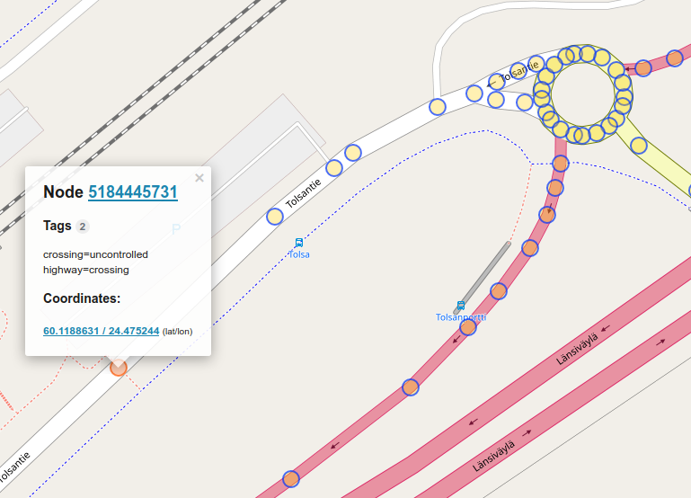

Pretty much every PT route is modeled as a relation in OSM.
However, we do not rely on OSM route data but take the routes from GTFS and use OSM only for network features.
We must also be prepared for exceptional routes: this means including links *allowed* for PT modes but not regularly used by them.
Can we query nodes and ways used by already modeled PT routes, and find unique types of nodes and ways from that set?

Let's try out this query in the [Overpass Turbo](http://overpass-turbo.eu/) "sandbox", to find bus routes:

```
[out:json];
rel["route"="bus"]({{bbox}});
out geom;
```

This query successfully returns us bus routes and their stops.
Here I chose a bounding box in Kirkkonummi:



This did not yet give us the set of ways and nodes *used by* those routes.
We can query the ways like this:

```
[out:json];
rel["route"="bus"]({{bbox}});
way(r)({{bbox}});
out geom;
```



And nodes:

```
[out:json];
rel["route"="bus"]({{bbox}});
node(r)({{bbox}});
out geom;
```



As you can see, the only nodes in the bus relations are the stops.
The stops are not physically part of the ways in question, so it's good that they are captured by the relation model.
We can get the nodes related to the ways that are in turn related to the bus routes by this query:

```
[out:json];
rel["route"="bus"]({{bbox}});
way(r)({{bbox}});
node(w)({{bbox}});
out geom;
```



From the *way* image you can see that the activated way goes beyond the pedestrian crossing point instead of ending there:
if we wanted to build a network where links are cut by crossing points, it would not be possible here by only using the OSM ways.
However, if we include the *nodes* related to these ways, we can use them to split the long links where necessary, meaning the crossing point in the above picture.


By using the shorthand `nwr` (node, way, relation) we can return the ways and stop nodes at the same time.

```
[out:json];
rel["route"="bus"]({{bbox}});
nwr(r)({{bbox}});
out geom;
```

Get tram track features on a certain date (try e.g. in Hämeentie):

```
[out:json][date:"2019-01-28T00:00:00Z"];
nwr["railway"="tram"]({{bbox}});
out geom;
```

Let us fetch the current tram network data from the entire Helsinki tram area.
I've defined the bounding box manually using 

```{r libraries-1, message=FALSE, warning=FALSE, include=FALSE}
library(tidyverse)
library(glue)
library(httr)
```

```
[out:json];
nwr["railway"="tram"](60.140091,24.858358,60.216751,25.002554);
out geom;
```

```{r fetchtram-1}
url <- 'http://overpass-api.de/api/interpreter?data=%5Bout%3Ajson%5D%3Bnwr%5B%22railway%22%3D%22tram%22%5D%2860%2E140091%2C24%2E858358%2C60%2E216751%2C25%2E002554%29%3Bout%20geom%3B%0A'
res <- GET(url = url)
```

The data is located under `elements` key of the JSON response.
This in turn is a list of features with type, id, bounds, geometry and tags.
In this case we're interested in unique combinations of tags within types (`node` and `way`).

```{r fetchtram-2}
into_row <- function(el) {
  l <- el$tags
  l$type <- el$type
  return(l)
}
c <- res %>% content()
df <- map_df(c$elements, into_row)
uniq_df <- df %>% unique()
```

**NOTE:** Tram tracks are easy