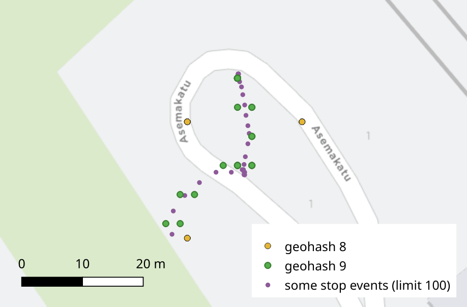

# General ideas

- Simplify coordinates (geohash)
- Combine adjacent records, if they have the same simplified position and same event type
- Do geohashing only for stopped points?

# Assumptions and validity tests for raw data

## Door status

- Does every event between `DOO` and `DOC` have `drst = true`?
- Are vehicles always stopped with `drst = true`?
- Can we safely discard all events between each `DOO` and `DOC`?

**If so**, then we can drop everything between `DOO` and `DOC`.


## Route geometry, planned vs. actual

- How much do the HFP points deviate from the nearest points projected on the related GTFS route shape?
- Are there clear outliers, and a limit under which points can be considered conforming to the planned route shape?

**If so**, then at this point any raw HFP point exceeding that distance limit can be discarded.

*Note:* we should actually use OSM segment version of the route shape, rather than GTFS geometry, but the latter is a simpler approximation in the beginning.


# Geohash

Simplify WGS84 geometries efficiently; affect the decimal accuracy.

```
WITH sample AS (
SELECT ST_Transform(geom, 4326) AS geom FROM hfp_stop_events LIMIT 100),
gh_group AS (
SELECT ST_GeoHash(geom, 8) AS geohash FROM sample)
SELECT geohash,
ST_Centroid(ST_Transform(ST_SetSRID(ST_GeomFromGeoHash(geohash), 4326), 3067)) AS geom
FROM gh_group;
```

The above query seems to aggregate deviated points into ~ 20 m resolution.
Using 9 would produce points almost identical to the original ones; some random deviation around a stopped vehicle could still be eliminated.


